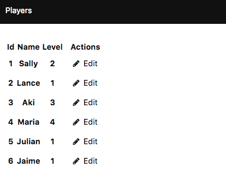

Example SPA in Miso
===================


An example GHCJS + Miso single page application.




Running the Application
-----------------------

### Docker

The application is packed as a Docker image, so you can launch it with a single command.

```console
docker run -d -p 4000:4000 ytaka23/miso-tutorial-app:latest
```

Access [http://localhost:4000](http://localhost:4000).

### Source

You can also build the application from source code. Note that, if it's your first experience of GHCJS, it takes a long time to set up the compiler.

```console
git clone https://github.com/y-taka-23/miso-tutorial-app.git
cd miso-tutorial-app
./run.sh
```

The script prepares compilation environments according to each `stack.yaml`, builds both of the client/server side stuffs and starts the web server. Access [http://localhost:4000](http://localhost:4000).


Highlights
----------

This project is ported from [Elm implementation](https://github.com/sporto/elm-tutorial-app). Miso framework aims to provide "The Elm Architecture" for GHCJS, thus its architecture looks very close to the original Elm application. Nevertheless, the Miso implementation has several interesting differences.

### Isomorphism

Isomorphism, also known as server side rendering (SSR,) is one of the most remarkable features of Miso framework. Implementing both of the client and server sides in the same language, that is Haskell, Miso can reuse most of the application and optimize the cost of renering.

As with The Elm Architecture, an isomorphic Miso application consists of the following parts:

* __[Model]()__ stores states of the application.
* __[Action]()__ triggers a state transition with a payload (Msg in Elm.)
* __[Update](https://github.com/y-taka-23/miso-tutorial-app/blob/master/client/Update.hs)__ makes a transit from the current state to the next, according to the incoming action.
* __[Subscription](https://github.com/y-taka-23/miso-tutorial-app/blob/master/client/Main.hs#L17)__ catches mainly user's input.
* __[Effect](https://github.com/y-taka-23/miso-tutorial-app/blob/master/client/Effect.hs)__ outputs anything to the outside world (Cmd in Elm.)
* __[View]()__ converts the model to an HTML response.
* __[Routing](https://github.com/y-taka-23/miso-tutorial-app/blob/master/shared/Routing.hs)__ determines which page should be rendered.

In Miso isomorphism, the models, actions and views are "shared" between the client/server sides.
When a browser accesses the web server for the first time, the server returns an HTML file built from the initial model and the view logic. Next, when the user changes the current URL (by a subscription) or accesses external APIs (by an effect,) JavaScript re-renders the page by the shared view and routing logic in the client side only.

| Client       | Shared  | Server           |
|:-------------|:--------|:-----------------|
| Update       | Model   | (Servant Server) |
| Subscription | Action  |                  |
| Effect       | View    |                  |
|              | Routing |                  |

### Path-based Routing by Servant API

On the top of Haskell's powerful type system, Miso can denote its routing as types, in the similar way with Servant. The following defines three routes : `/`, `/players` and `/players/:id` as a single page application.

```haskell
type Route =
         TopRoute
    :<|> ListRoute
    :<|> EditRoute

type TopRoute = View Action

type ListRoute = "players" :> View Action

type EditRoute = "players" :> Capture "ident" PlayerId :> View Action
```

Besides, for the server side, Miso converts and extends the client side routes to define the APIs. In the following snippet there are four APIs:

* `JsonApi` returns JSON files for XHR by Miso effects; `/api/players` and `/api/players/:id`.
* `IsomorphicApi`returns HTML files generated by SSR. 
* `StaticApi` returns static resources including JavaScript.
* `NotFoundApi` returns the 404 error page.

```haskell
type Api = JsonApi :<|> IsomorphicApi :<|> StaticApi :<|> NotFoundApi

type JsonApi =
         "api" :> "players" :> Get '[JSON] [Player]
    :<|> "api" :> "players" :> Capture "id" PlayerId
            :> ReqBody '[JSON] Player :> Put '[JSON] NoContent

type IsomorphicApi = ToServerRoutes Route HtmlPage Action

type StaticApi = "static" :> Raw

type NotFoundApi = Raw
```

### Effects in IO Monads

In The Elm Architecture, the `update` function has a type:

```elm
update : Msg -> Model -> (Model, Cmd Msg)
```

On the other hand in Miso:

```haskell
updateModel :: Action -> Model -> Effect Action Model
```

The `Effect` type is a sort of aliases, to handle `IO` actions asynchronously, implemented as:

```haskell
data Effect action model = Effect model [Sub action]
type Sub action = Sink action -> IO ()
type Sink action = action -> IO ()
```

It means that Miso can do arbitrary `IO` actions as effects. Moreover it provides several constructors to simply denote update with/without effects:

```haskell
(<#) :: model -> IO action -> Effect action model
noEff :: model -> Effect action model
```

Let's back to the example. Here `fetchPlayers` is just an `IO` action to fetch a player list via external connection. `updateModel` passes the result to `SetPlayers`, then again `updateModel` sets the player list without effects.

```haskell
fetchPlayers :: IO (Either String [Player])
updatePlayer :: Either String Player -> Model -> Model

updateModel FetchPlayers m = m <# do
    SetPlayers <$> fetchPlayers
updateModel (SetPlayer eP) m = noEff $ updatePlayer eP m
```

For more detail, see [the implementation](https://github.com/dmjio/miso/blob/master/ghcjs-src/Miso/Effect.hs).


References
----------

* [GHCJS](https://github.com/ghcjs/ghcjs)
* [Miso Framework](https://haskell-miso.org/)
* [Elm Tutorial](https://www.gitbook.com/book/sporto/elm-tutorial/details)
